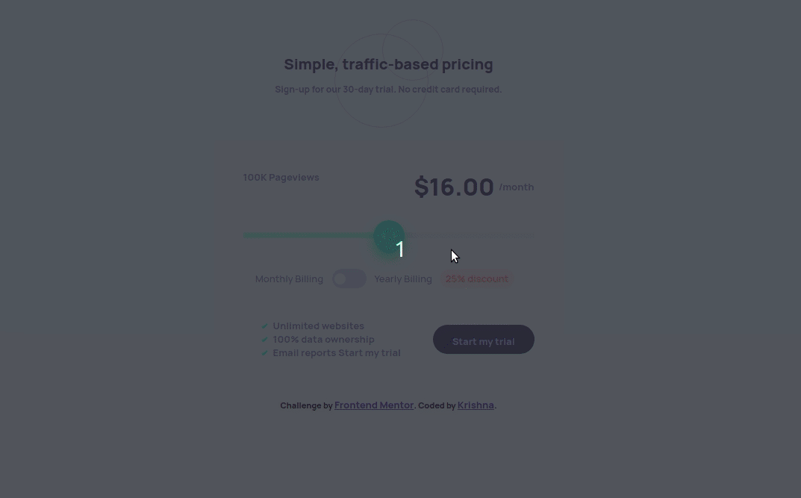

# Frontend Mentor - Interactive Pricing Component

This is my solution to the [Interactive pricing component challenge on Frontend Mentor](https://www.frontendmentor.io/challenges/interactive-pricing-component-t0m8PIyY8).

Frontend Mentor challenges help you improve your coding skills by building realistic projects.

## Table of contents

- [Overview](#overview)
  - [The challenge](#the-challenge)
  - [Screenshot](#screenshot)
  - [Links](#links)
- [My process](#my-process)
  - [Built with](#built-with)
  - [What I learned](#what-i-learned)
  - [Useful resources](#useful-resources)
- [Author](#author)

## Overview

### The challenge

Users should be able to:

- View the optimal layout for the app depending on their device's screen size
- See hover states for all interactive elements on the page
- Use the slider and toggle to see prices for different page view numbers

### Screenshot



### Links

- Solution URL: [Add solution URL here](https://your-solution-url.com)
- Live Site URL: [Add live site URL here](https://your-live-site-url.com)

## My process

### Built with

- Semantic HTML5 markup
- CSS custom properties
- JavaScript event listeners

### What I learned

- Although theres' a CSS-only way to have HTML range input with different background colors (before and after the slider thumb), I decided it's much simpler to use a linear background and little bit of JavaScriptt to listen to slider value changes and update the gradient stop.

- I found out we can use HTML `range` input to create a toggle button.

```html
<input type="range" min="0" max="1" />

<!-- and add some css to it -->
```

- and we can use image a custom icon for HTML lists

```html
<ul>
  <li>Item 1</li>
  <li>Item 2</li>
  <li>Item 3</li>
</ul>
```

```css
ul {
  list-style-image: url(./path-to-image.png);
}
```

### Useful resources

- [different background color html slider](https://stackoverflow.com/questions/18389224/how-to-style-html5-range-input-to-have-different-color-before-and-after-slider) - This helped me for get a rough idea on how to have different color on HTML range input.

## Author

- Website - [Personal Web](https://krishnarowter.com)
- Frontend Mentor - [@krowter](https://www.frontendmentor.io/profile/krowter)
